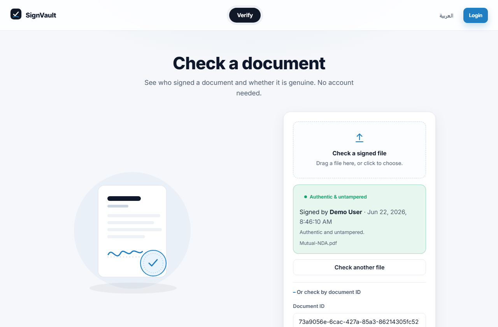

# SignVault — Digital Signature Platform

A full-stack web application in which the **server is the cryptographic signing authority**.
A user uploads a document, the platform signs it with its private RSA key (SHA-256 + X.509),
and **anyone** can later verify that the document is authentic and unaltered — without an
account, either by uploading the file or by opening a share link.

Built with **Angular 20**, **ASP.NET Core (.NET 10) Web API**, and **Entity Framework Core**.
It runs out of the box on SQLite and uses PostgreSQL in production via a single configuration
value.




> For a short, plain-language overview, open [`how-it-works.html`](how-it-works.html).
> Signatures are attributed to the signer (for example, "Signed by Anas"), and anyone can
> verify a document without an account.

---

## Live demo and deployment

**Run the published image (Docker) — the whole application in one command:**

```bash
docker run -p 8080:8080 ghcr.io/anas-lees/digital-signature-platform:latest
# open http://localhost:8080   ·   demo login: demo@signvault.local / Demo1234!
```

The image is built and published to the GitHub Container Registry by CI on every push to
`main`; the [package](https://github.com/Anas-Lees/digital-signature-platform/pkgs/container/digital-signature-platform)
is public.

**Deploy to a public URL (free):**

[](https://render.com/deploy?repo=https://github.com/Anas-Lees/digital-signature-platform)

One click, connect GitHub, and Render builds the [`Dockerfile`](Dockerfile) from
[`render.yaml`](render.yaml) — provisioning a free PostgreSQL database and returning a live
`https://…onrender.com` URL. The same image runs on Fly.io, Railway, or Azure App Service.

**Deploy on Windows / IIS — one command** (approve a single administrator prompt):

```powershell
powershell -ExecutionPolicy Bypass -File .\deploy\Deploy-IIS-All.ps1
```

**Continuous deployment** and persistence details are in [`deploy/DEPLOY.md`](deploy/DEPLOY.md).
In short: the Render blueprint persists accounts and documents in PostgreSQL automatically;
to keep signatures valid across redeploys, generate a stable key with
[`deploy/New-SigningKey.ps1`](deploy/New-SigningKey.ps1) and set `Signing__PfxBase64` +
`Signing__PfxPassword` in the service environment.

---

## What it guarantees

| Property | Meaning | Mechanism |
|---|---|---|
| Integrity | Not one byte has changed since signing | SHA-256 hash |
| Authenticity | Signed by SignVault, not an impostor | RSA signature with a private key only the server holds |
| Non-repudiation | The action cannot later be denied | Append-only audit log with timestamps |

---

## Technology

- **Frontend:** Angular 20 (standalone components, signals), TypeScript; bilingual
  English/Arabic interface with full right-to-left support.
- **Backend:** ASP.NET Core Web API (.NET 10), C#, dependency injection, a middleware
  pipeline, forwarded-headers handling, HSTS, security headers, and per-client rate limiting.
- **Data:** Entity Framework Core. SQLite for local development; PostgreSQL in production
  (auto-detected from `DATABASE_URL`). Also a one-line change to SQL Server, Oracle, or MySQL.
- **Authentication:** JWT bearer tokens, BCrypt password hashing, role-based access, and
  server-side ownership checks.
- **Cryptography:** `System.Security.Cryptography` — RSA-3072, SHA-256, X.509 certificate.
- **Documents:** signed PDF certificates generated with QuestPDF.

```
+--------------+    HTTPS / JSON    +---------------------+    EF Core    +------------+
|  Angular SPA |  ---------------\  |  ASP.NET Core API    |  ---------\   |  Database  |
| (browser UI) |  <--------------/  |  signing authority   |  <--------/   | SQLite/PG  |
+--------------+                    +----------+----------+               +------------+
                                               |  holds the private signing key
                                               v
                                       X.509 certificate (PFX / env var / HSM)
```

In production the API serves the compiled Angular application from `wwwroot` and exposes the
API under `/api`, so the whole product runs as a single origin behind one URL.

---

## Running locally

**Prerequisites:** [.NET 10 SDK](https://dotnet.microsoft.com/download),
[Node.js 20+](https://nodejs.org), and the Angular CLI (`npm install -g @angular/cli`).
No database setup is required; SQLite is created on first run.

```bash
# Terminal 1 — API (http://localhost:5080, API docs at /scalar/v1)
cd backend/SignVault.Api
dotnet run

# Terminal 2 — web app (http://localhost:4200, proxies /api to the API)
cd frontend
npm install        # first time only
npm start
```

Sign in with the seeded demo account (`demo@signvault.local` / `Demo1234!`) or register a new
one. In VS Code, open the repository root and use two integrated terminals; the recommended
extensions are **C# Dev Kit** and **Angular Language Service**.

---

## Using it

1. Sign in (or register).
2. Upload a document; its SHA-256 hash is recorded.
3. Sign it. The server signs it with its private key and the result shows "Signed by you".
4. Download a **PDF certificate**, copy a public **share link**, or **delete** the document.
5. On the **Verify** page (no account required), drop the file or paste a document ID to see
   who signed it and whether it is unaltered. Editing the file makes verification fail.
6. Toggle العربية / English in the header for the right-to-left bilingual interface.

---

## API overview

| Method | Route | Access | Purpose |
|---|---|---|---|
| `POST` | `/api/auth/register` | Public | Create an account, receive a JWT |
| `POST` | `/api/auth/login` | Public | Authenticate, receive a JWT |
| `GET` | `/api/auth/me` | Authenticated | Current user |
| `GET` | `/api/documents` | Authenticated | List the caller's documents |
| `POST` | `/api/documents/upload` | Authenticated | Upload a file |
| `POST` | `/api/documents/{id}/sign` | Authenticated | Sign a document |
| `GET` | `/api/documents/{id}/download` | Authenticated | Download the original file |
| `GET` | `/api/documents/{id}/certificate` | Authenticated | Download a PDF certificate |
| `DELETE` | `/api/documents/{id}` | Authenticated | Delete a document |
| `GET` | `/api/verify/public-key` | Public | The platform's public key |
| `POST` | `/api/verify` | Public | Verify by file (locate the signature by hash) |
| `GET` | `/api/verify/{documentId}` | Public | Verify the stored copy (share links) |
| `POST` | `/api/verify/{documentId}` | Public | Verify an uploaded file against a document |

---

## Security

- Passwords are stored only as BCrypt hashes (work factor 12).
- Every protected endpoint requires a validated JWT, and ownership is re-checked server-side.
- The private signing key is loaded from `Signing__PfxBase64` (an environment variable) in
  production, or generated to a git-ignored PFX locally. For the highest assurance, use an
  HSM or certificate store.
- A signature and its audit record commit inside a single EF Core transaction.
- The API sends HSTS and standard security headers and applies a per-client rate limit.

This is a portfolio project. For legally-binding signatures, use a qualified Certificate
Authority and a hardware HSM, and review the relevant regulations (eIDAS, ESIGN, and local law).

---

## Database portability

SQLite is the default. To target another engine, change the provider registration in
`Program.cs` and the connection string — the entities, services, and frontend are untouched:

```csharp
opt.UseSqlite(conn);                               // default
opt.UseNpgsql(conn);                               // PostgreSQL (Npgsql.EntityFrameworkCore.PostgreSQL)
opt.UseSqlServer(conn);                            // SQL Server  (Microsoft.EntityFrameworkCore.SqlServer)
opt.UseMySql(conn, ServerVersion.AutoDetect(conn));// MySQL       (Pomelo.EntityFrameworkCore.MySql)
```

In production the provider is selected automatically: set `DATABASE_URL` (or
`ConnectionStrings__Default`) to a PostgreSQL connection and the application uses it.

---

## Project structure

```
digital-signature-platform/
├── backend/SignVault.Api/
│   ├── Domain/          entities and enums
│   ├── Data/            AppDbContext, migrations, seed, provider selection
│   ├── Dtos/            request/response contracts
│   ├── Services/        signer, JWT, file store, audit, PDF certificate
│   ├── Controllers/     Auth, Documents, Verify
│   └── Program.cs       DI, auth, hardening, single-origin hosting
├── frontend/src/app/
│   ├── core/            auth service, JWT interceptor, guard, document service, i18n
│   ├── shared/          brand mark, document illustration
│   └── features/        login, register, documents, verify
├── Dockerfile           single-origin production image (API serves the SPA)
├── render.yaml          cloud deploy blueprint (web service + PostgreSQL)
├── deploy/              publish and IIS scripts, signing-key generator, DEPLOY.md
└── .github/workflows/   CI: build, publish image to GHCR, deploy
```

---

## Testing

```bash
cd backend/SignVault.Api && dotnet build      # backend compiles and runs
cd frontend && npm test                        # Angular unit tests (Jasmine/Karma)
```

## License

[MIT](LICENSE) © 2026 Anas-Lees
